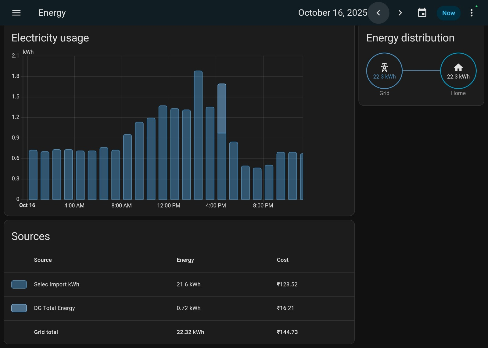

# Energy Monitoring System — Project Report

## 🌟 Introduction
The vision was simple: understanding energy consumption should be as intuitive as viewing it on a live dashboard.

To bring this idea to life, our team built an integrated energy monitoring system using Home Assistant as the backbone, Modbus-based energy meters for accurate data acquisition, and a Raspberry Pi for real-time processing and visualization.

---

## 🔋 Features Implemented
- *Real-Time Energy Monitoring* – live tracking of voltage, current, and power  
- *Multi-Source Tracking* – monitoring both BESCOM (grid) and DG supply  
- *Cost Estimation* – dynamic calculation of electricity usage cost  
- *Alerts & Notifications* – detection of overload, over-voltage, and abnormal usage
- *Interactive Dashboard* – graphical visualization of energy consumption trends  

---

## 🛠️ Languages & Technologies Used
- **YAML** – Dashboard structure and configuration
- **Jinja2** – Dynamic data rendering and logic
- **CSS** – UI styling and theming
- **JavaScript** – Used by custom cards (indirectly)

---

## ⚙ Technology Stack
- *Home Assistant* (central monitoring & visualization platform)  
- *Modbus RS485* (reliable energy data communication) 
- *Selec Energy Meter* (accurate measurement of electrical parameters)
- *Raspberry Pi* (local processing and integration)
- *YAML Configuration* for dashboard customization  

---

## 📂 Proof of Implementation
YAML configuration files are available in the [yaml-proof](yaml-proof/energy_metering.yaml) folder.  

Snippet:

yaml
views:
  - title: Home
    sections:
      - type: grid
        cards:
          - type: custom:mushroom-title-card
            grid_options:
              columns: 36
              rows: 0.7
          - type: vertical-stack
            cards:
              - type: custom:energy-period-selector-plus
                card_background: false
                today_button: true
                prev_next_buttons: true
.
.

---

## 📸 Dashboard

---

## 🎥 Videos

  

    
<b>Energy Usage Grapgh</b>

    <video width="100%" controls>
      <source src="videos/energy_graph.mp4" type="video/mp4">
    </video>
    
<a href="videos/energy_graph.mp4">▶ Watch / Download</a>

  

  

    
<b>Energy Usage Grapgh</b>

    <video width="100%" controls>
      <source src="videos/energy_monitoring_graph.mp4" type="video/mp4">
    </video>
    
<a href="videos/energy_monitoring_graph.mp4">▶ Watch / Download</a>

  

  ---

## 👥 Team

This project was built by: *Abhilash, **Amogh, **Chaitra* and *Hansikha Venkatesh*

---

## 🔮 Future Scope

- Expansion to multi-building or apartment-level monitoring systems
- Integration with smart plugs for appliance-level energy monitoring
- Integration with renewable energy sources (solar)
- Cloud-based data logging and remote access for long-term analysis
  

---

## 📜 License

This project is licensed under the [MIT License](LICENSE).
